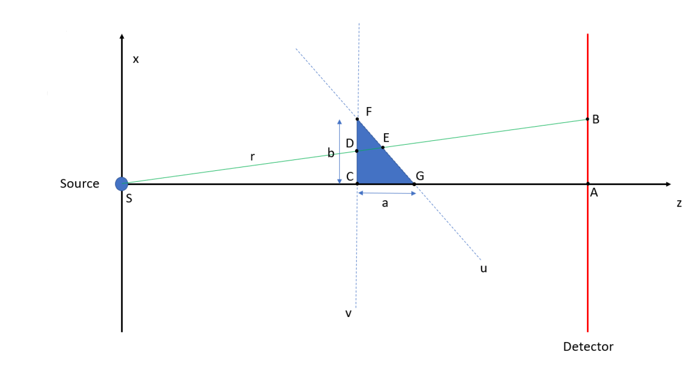
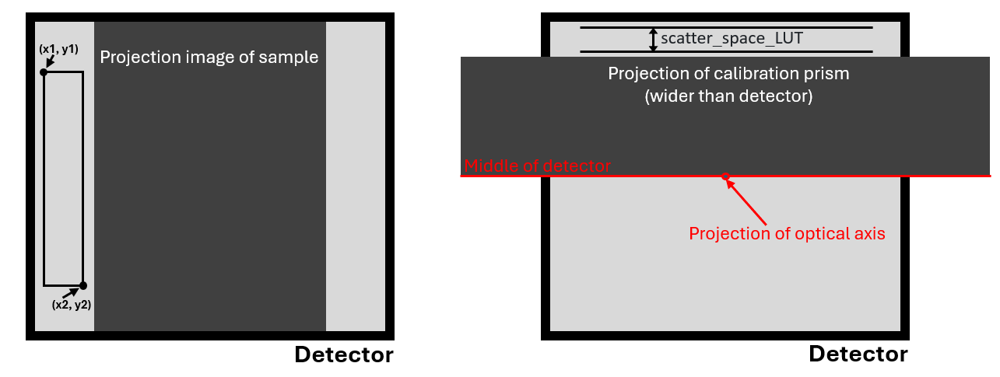

<p align="center">
  
</p>

<p align="center">
    <h1 align="center">Heel Correction</h1>
</p>


[]()

[De Bolle, Jorden](https://orcid.org/0000-0002-5179-1725)[^aut][^UG-RP][^UG-SSS];
[Verschuren, Louis](https://orcid.org/0000-0002-3102-4588)[^aut][^cre][^UG-WL];
[Van den Bulcke, Jan](https://orcid.org/0000-0003-2939-5408)[^aut][^UG-WL]
[Boone, Matthieu N.](https://orcid.org/0000-0002-5478-4141)[^aut][^UG-RP];

[^aut]: author
[^cre]: contact person
[^UG-WL]: UGent-Woodlab, Department of Environment, Ghent University, Coupure Links 653, Gent, 9000, Belgium
[^UG-RP]: RP-UGCT, Department of Physics and Astronomy – Radiation Physics, Ghent University, Proeftuinstraat 86, Gent, 9000, Belgium
[^UG-SSS]: Current affiliation: Department of Solid State Sciences - CoCooN research group, Ghent University, Krijgslaan 286, Gent, 9000, Belgium


<p align="left">
   This is the repository for a Python routine that corrects for the heel effect in (helical) X-ray micro-CT scans. It's primary use is increasing the accuracy with which the local mass densities in wood increment cores can be determined. The correction happens on the level of the normalised projection images of the scan. It requires a radiographic projection of a prism-shaped calibration sample that was obtained with the same tube settings and source-to-detector distance as the CT-scan. After correction and reconstruction, one obtains a 3D reconstructed volume that is to a large extent free of consequences from the heel effect and cupping ( which arises as a consequence of beam hardening). The volume consists of voxels that contain a gray-value that is proportional to the local mass density in the sample. By using the Numba library, the routine was optimised to run on an NVIDIA GPU for fast execution.
</p>


<p align="center">
	<!-- local repository, no metadata badges. --></p>
<p align="center">
		<em>Built with the tools and technologies:</em>
</p>
<p align="center">
	
	
	
	

	
</p>
<br>

#####  Table of Contents

- [ Introduction to the method](#introduction)
- [ Getting Started](#getting-started)
- [ Performing a heel correction](#performing-a-heel-correction)
- [ Cite our work](#cite-our-work)
- [ License](#license)

---

##  Introduction to the method

In most conventional X-ray tubes, the anode target is tilted with respect to the optical axis of the measurement system. However, the tilt causes a spatial variation of the X-ray spectrum throughout the generated X-ray beam, a spatio-spectral effect called the (anode) heel effect. Since the sample in a micro computed tomography (µCT) scan experiences an asymmetry in the X-ray beam spectrum due to the heel effect, the projection images will contain an asymmetry as well. This influences the resulting reconstructions from the µCT scan. As a consequence, the heel effect hinders an accurate determination of local material densities with µCT, particularly when using a helical trajectory. In this paper, a method will be demonstrated that is capable of correcting for the heel effect in helical µCT scans where the heel effect is oriented perpendicular to the rotation axis. This increases the accuracy of the obtained local mass densities. In addition, the method removes beam hardening effects. The method is based on a lookup table (LUT) that is used to correct pixel values in the normalised projection images of the CT scan in order to eliminate the asymmetry introduced by the heel effect. We demonstrate this correction algorithm on a helical CT scan of wood increment cores, which sufficiently satisfies the method’s requirement of a homogeneous chemical composition. Nonetheless, the method can be used in a wide variety of applications.

---

## Getting started

Before running the notebooks, ensure that you have the following dependencies installed:
- numpy
- numba
- matplotlib
- scipy
- pylibtiff
- os
- re
- PIL
- seaborn
- time
- math
- cudatoolkit
- pytest-shutil

---

## Performing a heel correction

Running a heel correction requires the following: 
 - All projection images of the CT scan are available
 - A projection image of a calibration prism is available, recorded with the same tube settings and source-to-detector distance as the CT scan
 - Dark field and flat field images for both the CT scan and the projection image of the calibration prism are available
 - The sample has a homogeneous chemical composition to ensure that all mass anttenuation coefficients have the same energy dependency
 - The calibration prism is made of an equivalent material as the sample under study

Furthermore, the software assumes the calibration prism is placed on top of the optical axis of the CT scanner with the vertical flat side facing the source and the source-to-object distance optimised such that the projection of the prism is wider than the detector in order to avoid edge effects. 

The software requires the following parameters, which are explained in the figures below:
 - a: maximal thickness of the prism (thickness at the bottom) (in mm)
 - b: height of the prism (in mm)
 - SOD: source-to-objecte distance (distance from source to flat vertical plane of prism, prism is placed in scanner such that vertical plane faces the source)
 - SDD: source-to-detector distance (should be same in scan as in projection of prism in order to have same heel effect)
 - detector_height: height of the detector in pixels as used for the projection images in the data set that is being corrected
 - detector_width: width of the detector in pixels as used for the projection images in the data set that is being corrected
 - LUT_height: eventual height of the LUT that will be used (for example 1010 pixels if projection of prism only uses top 1000 pixels of detector)
 - pixelsize: size of a pixel in mm
 - scatter_space_LUT: height in pixels available above the prism to calculate scattering in projection of the prism
 - scatter_space_projections: [x1, x2, y1, y2], defines a region in the projection images that is used for calculating the scattering value

<p align="center">
  
</p>
<p align="center">
  
</p>

---

## Cite our work

You can find the paper where the entire pipeline is described [here](https://doi.org/10.1016/j.precisioneng.2025.06.019), or cite our work with the following bibtex snippet:

```tex
@article{DEBOLLE2025,
title = {Correction for the heel effect in helical μCT scans for accurate densitometry},
journal = {Precision Engineering},
year = {2025},
issn = {0141-6359},
doi = {https://doi.org/10.1016/j.precisioneng.2025.06.019},
author = {Jorden {De Bolle} and Louis Verschuren and Jan {Van den Bulcke} and Matthieu N. Boone},
keywords = {μCT, Heel effect, Densitometry, X-ray}
}
```


When using any of the software, also cite the proper Zenodo DOI [here](TODO)

---

##  License

This software is protected under the [GNU AGPLv3](https://choosealicense.com/licenses/agpl-3.0/) license. 

---
